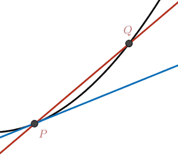
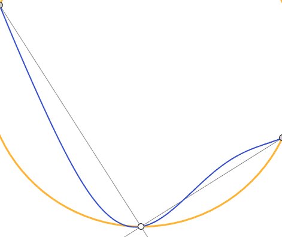
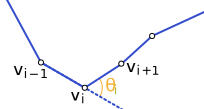
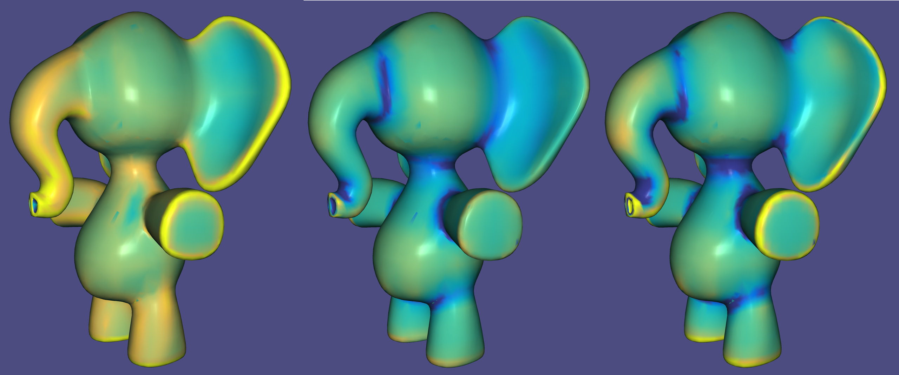
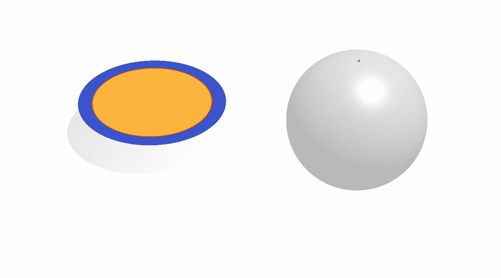
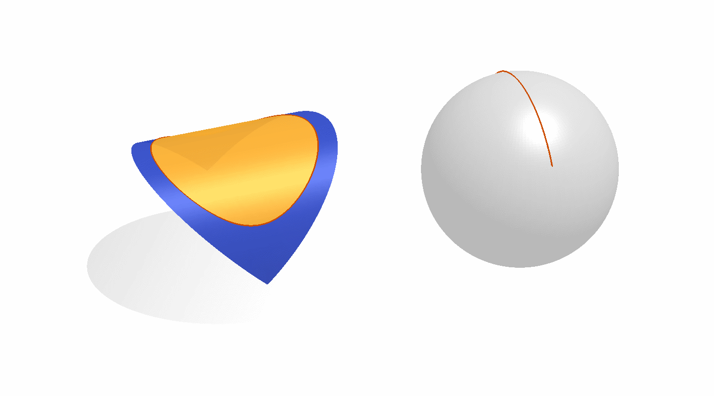
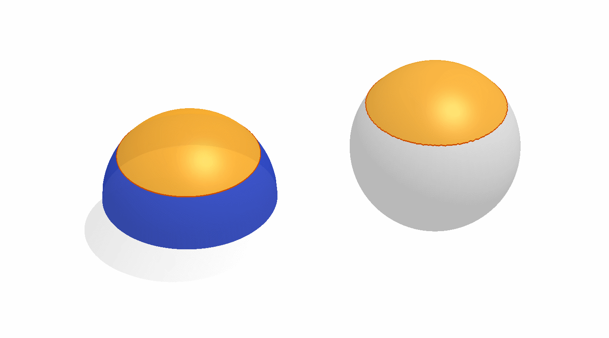

# Geometry Processing - Curvature 

> **To get started:** Clone this repository then issue
> 
>     git clone --recursive http://github.com/[username]/geometry-processing-curvature.git
>

## Installation, Layout, and Compilation

See
[introduction](http://github.com/alecjacobson/geometry-processing-introduction).

## Execution

Once built, you can execute the assignment from inside the `build/` by running
on a given mesh:

    ./curvature [path to mesh.obj]

## Background

In this assignment we explore discrete curvature quantities computed on a
surface. These quantities give us local information about a shape. Beyond
inspecting the surface (the extent of this assignment), these quantities become
the building blocks to:

 - define energies to minimize during smoothing/deformation,
 - identify salient points and curves on the shape, and 
 - provide initial conditions/constraints for _remeshing_.

The fundamental difference between a segment on the real line and a curve is
the introduction of [curvature](https://en.wikipedia.org/wiki/Curvature). This
is quite natural and intuitive. When we draw a 1D object in the plane or in
space we have the freedom to let that object bend. We quantify this "bending"
locally as curvature.

[Curvature](https://en.wikipedia.org/wiki/Curvature#Surfaces) is also the
fundamental difference between a chunk (i.e., subregion) of the [Euclidean
Plane](https://en.wikipedia.org/wiki/Plane_(geometry)) and a
[surface](https://en.wikipedia.org/wiki/Surface_(mathematics)) that has been
[immersed](https://en.wikipedia.org/wiki/Immersion_(mathematics)) in $\mathbb{R}^3$ (or
elsewhere). Unlike curves, surfaces can bend in each direction at any point.

We start our discussion assuming a smooth surface $\mathcal{S}$. We would like to
categorize points on the surface $\mathbf{p} \in  \mathcal{S}$ in terms of how the surface bends or
curves locally. 

### Curvature of planar curves

Let us briefly recall how
[curvature](https://en.wikipedia.org/wiki/Curvature#Precise_definition) is
defined for a [planar curve](https://en.wikipedia.org/wiki/Plane_curve)
${\gamma}:[0,1] \rightarrow  \mathbb{R}^{2}$.

There are multiple equivalent definitions.

#### Osculating circle

We can define the [tangent](https://en.wikipedia.org/wiki/Tangent) direction at
a point $\mathbf{p} = {\gamma}(s)$ as the limit of the
[secant](https://en.wikipedia.org/wiki/Secant_line) formed between $\mathbf{p}$ and
another point on the curve $\mathbf{q} = {\gamma}(t)$ as $\mathbf{q}$ approaches $\mathbf{p}$:

$$
\mathbf{t}(s) = \lim_{\mathbf{q}\rightarrow \mathbf{p}} \frac{\mathbf{q}-\mathbf{p}}{\|\|\mathbf{q}-\mathbf{p}\|\|} = 
\lim_{t\rightarrow s} \frac{{\gamma}(t)-{\gamma}(s)}{\|\|{\gamma}(t)-{\gamma}(s)\|\|} = \frac{{\gamma}'(s)}{\|\|{\gamma}'(s)\|\|}.
$$

It always possible, and often convenient, to assume without loss of generality
that $s$ is an [arc length
parameterization](https://en.wikipedia.org/wiki/Arc_length) of the curve ${\gamma}$ so
that $\|\|{\gamma}'\|\| = 1$ and therefore the unit tangent vector is simply ${\mathbf{t}}(s) = {\gamma}\'(s)$ .

In an analogous fashion, we can consider the limit of the
[circumcircle](https://en.wikipedia.org/wiki/Circumscribed_circle)
$C(\mathbf{q}\_{1},\mathbf{p},\mathbf{q}\_{2})$ that passes
through $\mathbf{p}$ and points $\mathbf{q}\_{1}$ and $\mathbf{q}\_{2}$ before and after it on the curve:

$$
C(\mathbf{p}) = \lim_{\mathbf{q}_{1},\mathbf{q}_{2}\rightarrow \mathbf{p}} C(\mathbf{q}_{1},\mathbf{p},\mathbf{q}_{2}).
$$

This limit circle is called the [osculating
circle](https://en.wikipedia.org/wiki/Osculating_circle) at the point $\mathbf{p}$ on
the curve ${\gamma}$. By construction the tangent of the curve and the circle match at
$\mathbf{p}$: they're both ${\gamma}'$. The
[radius](https://en.wikipedia.org/wiki/Radius_of_curvature) $R(\mathbf{p})$ of the
osculating circle $C(\mathbf{p})$ at the the point $\mathbf{p}$ is proportional to how straight
the curve is locally: as the curve becomes more and more straight then the
radius tends toward infinity. This implies that the radius is inversely
proportional to the "curvy-ness" of the curve. Hence, the inverse of the radius
is dubbed the curvature:

$$
{\kappa}(\mathbf{p}) = \frac{1}{R(\mathbf{p})}.
$$

The radius is a non-negative measure of length with units meters, so the
curvature ${\kappa}$ is an non-negative scalar with units 1/meters. The radius of the
osculating circle can also be written as a limit of the [circumcircle
radius](https://en.wikipedia.org/wiki/Circumscribed_circle#Cartesian_coordinates_from_cross-_and_dot-products):

$$
R(\mathbf{p}) = \lim_{\mathbf{q}_{1},\mathbf{q}_{2}\rightarrow \mathbf{p}} 
  \frac{\|\| \mathbf{q}_{1}-\mathbf{p}\|\|  \|\| \mathbf{p}-\mathbf{q}_{2}\|\|  \|\| \mathbf{q}_{2}-\mathbf{q}_{1}\|\| }
  {2\left| (\mathbf{q}_{1}-\mathbf{p}) \quad (\mathbf{p}-\mathbf{q}_{2})\right|}.
$$

#### Signed curvature

Plugging in our arc-length parameterization this reveals that the curvature
(inverse of radius) is equal to the magnitude of change in the tangent or
equivalently the magnitude of second derivative of the curve:

$$
{\kappa}(s) = \lim_{t\rightarrow s} \left\|\left\| \frac{{\gamma}'(t)-{\gamma}'(s)}{t-s} \right|\right| = \|\| {\gamma}''(s)\|\| .
$$

Because we chose the arc-length parameterization, the only change to the
tangent vector ${\gamma}'$ is a change in _direction_ (as opposed to magnitude, since
$\|\| {\gamma}'\|\|  := 1$). This means that the change--as a vector itself--is
_orthogonal_ to the tangent. In other words, the change in tangent ${\gamma}''$ points
along the <a id=curvature-normal>normal direction</a> $\widehat{\mathbf{n}}$:

$$
{\gamma}'' \cdot  {\gamma}' = 0 \quad \rightarrow  \quad {\gamma}'' \cdot  \widehat{\mathbf{n}} = \pm  {\kappa} \widehat{\mathbf{n}}.
\label{equ:curvature-normal}
$$

If we define an orientation to our curve  then we can endow the curvature with
a [sign](https://en.wikipedia.org/wiki/Sign_(mathematics)) based on whether the
center of the osculating circle lies on the [left or right
side](https://en.wikipedia.org/wiki/Right-hand_rule) of the curve. As already
established, the tangent of the osculating circle and the curve agree, so the
vector pointing toward the circle's center must be
[perpendicular](https://en.wikipedia.org/wiki/Perpendicular) to the tangent:
i.e., in either the positive or negative
[normal](https://en.wikipedia.org/wiki/Normal_(geometry)) directions. 

If the orientation agrees with increasing the arc-length parameter $s$, then the sign can
be 
determined by comparing the second derivative vector ${\gamma}''$ to the unit normal $\widehat{\mathbf{n}} := ({\gamma}')^{\perp}$. The [_**signed
curvature**_](https://en.wikipedia.org/wiki/Curvature#Signed_curvature) at a point $\mathbf{p}$ is thus given by:

$$
\begin{align*}
k(\mathbf{p}) &= \text{sign}({\gamma}''(\mathbf{p})\cdot \widehat{\mathbf{n}}))\ {\kappa}(\mathbf{p})  \\
      &= {\gamma}''(\mathbf{p}) \cdot  \widehat{\mathbf{n}}.
\end{align*}
$$

#### Moving point analogy

This definition neatly conforms to our intuition of a curve as the trajectory
of a moving point. Imagine the curved formed by driving along a particular
trajectory ${\gamma}(t)$, where we really interpret $t$ as time.

While ${\gamma}'(t)$ corresponds to your velocity vector and $\|\| {\gamma}'(t)\|\|$ corresponds to
your speed, the arc-length (re-)parameterization would correspond to having
your friend re-trace your path traveling at a perfectly uniform speed $\|\|{\gamma}'(s)\|\| = 1$, where your friends "time" $s$ may be different from yours (it may take
longer or shorter depending if you drove fast or slow).

Curvature in the path corresponds to _turning_ and quite literally the amount
by which your friend needs to turn the steering wheel away from the "straight"
position: on a straight course, the steering wheel remains at zero-angle
position and the curvature is zero, on a circular course the steering wheel is
fixed at a constant angle in the left or right direction corresponding to
constant positive or negative curvature respectively.

Changing the steering wheel changes the _direction_ of the vehicle's velocity.
For your friend driving at constant speed, this is the _only_ change admissible
to the velocity, hence the curvature exactly corresponds to ${\gamma}''(s)$ and to the
steering wheel angle.

> If somebody wants to make a Sega [Out
> Run](https://en.wikipedia.org/wiki/Out_Run) inspired gif showing a steering
> wheel turning next to a little car tracing a curve, I'll be very impressed.

#### Turning number

The integrated signed curvature around a [closed
curve](https://en.wikipedia.org/wiki/Curve) must be an integer multiple of
$2{\pi}$:

$$
{\oint} k(s) \ ds = 2{\pi} {\tau},
$$

where $\tau$ is an integer called the "turning number" of the curve. 

This is a bit surprising at first glance. However, in the _moving point
analogy_ a closed curve corresponds to a period trajectory (e.g., driving
around a race-track). When we've made it once around the track, our velocity
direction (e.g., the direction the vehicle is facing) must be pointing in the
original direction. That is, during the course, the car either have turned all the
way around once ( ${\tau} = 1$ ) or turned as much clockwise and it did
counter-clockwise (e.g., on a figure 8 course: ${\tau}=0$), or made multiple
loops, etc.

#### Discrete curvature

In the discrete world, if a curve is represented as a piecewise-linear chain of
segments, then it's natural to associate curvature with vertices: the segments
are flat and therefor contain no curvature.

A natural analog to the definition of curvature as 
the derivative of the tangent vector 
(i.e., $k = \|\| {\gamma}''\|\|  = \|\| \mathbf{t}'\|\| $) is to define _discrete curvature_ as the change in
tangent direction between discrete segments meeting at a vertex:

$$
k_i =  {\angle} (\mathbf{v}_i - (\mathbf{v}_{i-1}-\mathbf{v}_i)) \mathbf{v}_i\mathbf{v}_{i+1} = {\theta}_i,
$$

that is, the signed [_exterior
angle_](https://en.wikipedia.org/wiki/Internal_and_external_angles) ${\theta}_i$ at
the vertex $\mathbf{v}_i$.

The turning number theorem for continuous curves finds an _immediate_ analog in
the discrete case. For a closed polygon the discrete signed angles must sum up
to a multiple of $2{\pi}$ in order to close up:

$$
\sum\limits_{i=1}^n k_i = 2{\pi} {\tau}.
$$

In this way, we _preserve the structure_ found in the continuous case in our
discrete analog. This structure preservation leads to an understanding of the
exterior angle as an approximation or discrete analog of the _locally
integrated_ curvature.

Alternatively, we could literally fit an circle to the discrete curve based on
local samples and approximate curvature as the inverse radius of the osculating
circle. This curvature measure (in general) will not obey the turning number
theorem, but (conducted properly) it will converge to the pointwise continuous
values under refinement (e.g., as segment length shrinks).

We will explore these two concepts for surfaces, too: discrete analogs that
preserve continuous structures and discretizations that approximate continuous
quantities in the limit.

### Curvature(s) on surfaces

A surface can be curved locally in multiple ways. Consider the difference
between a flat piece of paper, a spherical ping-pong ball and a saddle-shaped
[Pringles chip](https://en.wikipedia.org/wiki/Pringles). The Pringles chip is
the most interesting because it curves "outward" in one direction and "inward"
in another direction. In this section, we will learn to distinguish and
classify points on a surface based on how it curves in each direction.

#### Normal curvature

The simplest way to extend the curvature that we defined for planar curves to a
surface $\mathcal{S}$ is to _slice_ the surface through a given point $\mathbf{p}\in \mathcal{S}$ with a
[plane](https://en.wikipedia.org/wiki/Plane_(geometry)) $\mathbf{P}$ that is parallel
to the [surface normal](https://en.wikipedia.org/wiki/Normal_(geometry))
$\mathbf{n}(\mathbf{p})$.

The (local) intersection of the surface $\mathcal{S}$ and the plane $\mathbf{P}$ will trace a
curve ${\gamma}$, upon which we can immediately use the planar curvature definition
above. 

](images/normal-curvature.svg)

There are infinitely many planes that pass through a given point $\mathbf{p}$ and lie
parallel to a given normal vector $\mathbf{n}(\mathbf{p})$: the plane can rotate around the
normal $\mathbf{n}(\mathbf{p})$ by any angle ${\varphi}$. For each choice of ${\varphi}$, the plane will define
an intersecting curve ${\gamma}_{\varphi}$ and thus for every angle ${\varphi}$ there will be a
[_normal curvature_](https://en.wikipedia.org/wiki/Curvature#Normal_sections):

$$
k_\mathbf{n}({\varphi},\mathbf{p}) = {\gamma}''_\varphi(\mathbf{p}).
$$

#### Mean curvature

Normal curvature requires choosing an angle, so it doesn't satiate our
desire to reduce the "curvy-ness" to a single number for any point on the
surface. A simple way to reduce this space of normal curvatures is to, well,
average all possible normal curvatures. This defines the [mean
curvature](https://en.wikipedia.org/wiki/Mean_curvature):

$$
H(\mathbf{p}) = \frac{1}{2{\pi}}\int\limits_0^{2{\pi}} k_\mathbf{n}({\varphi},\mathbf{p}) \ d{\varphi}.
$$

#### Maximum and minimum curvature 

Another obvious way to reduce the space of normal curvatures to a single number
is to consider the maximum or minimum normal curvature over all choices of ${\varphi}$:

$$
\begin{align*}
k_{1}(\mathbf{p}) &= \max\_{\varphi} \ k_\mathbf{n}({\varphi},\mathbf{p}) \\
k_{2}(\mathbf{p}) &= \mathop{\text{min}}\_{\varphi} \ k_\mathbf{n}({\varphi},\mathbf{p}).
\end{align*}
$$

Collectively, these are referred to as the [principal
curvatures](https://en.wikipedia.org/wiki/Principal_curvature) and
correspondingly the angles that maximize and minimize curvature are referred to
as the principal curvature directions:

$$
\begin{align*}
{\varphi}\_{1}(\mathbf{p}) &= \mathop{\text{argmax}}\_{\varphi} \ k_\mathbf{n}({\varphi},\mathbf{p}) \\
{\varphi}\_{2}(\mathbf{p}) &= \mathop{\text{argmin}}\_{\varphi} \ k_\mathbf{n}({\varphi},\mathbf{p}).
\end{align*}
$$

[Euler's
theorem](https://en.wikipedia.org/wiki/Euler%27s_theorem_(differential_geometry))
states that the normal curvature is a quite simple function of ${\varphi}$ and the
principal curvatures:

$$
k_\mathbf{n}({\varphi},\mathbf{p}) = k_{1} \cos^2 {\varphi} + k_{2} \sin^2 {\varphi},
$$

([proof](https://math.stackexchange.com/a/1783316/35376)).

There are two immediate and important consequences:

 1. the principal curvature directions ( ${\varphi}\_{1}$ and ${\varphi}\_{2}$ ) are orthogonal, and 
 2. the mean curvature reduces to the average of principal curvatures:

$$
H = \frac12 (k_{1} + k_{2}).
$$

> For more theory and a proof of Euler's theorem, I recommend "Elementary
> Differential Geometry" by Barret O'Neill, Chapter 5.2.

#### Gaussian curvature

Maximum, minimum and mean curvature reduce curvature to a single number, but
still cannot (alone) distinguish between points lying on a round ping-pong
ball, a flat sheet of paper, the cylindrical Pringles can and a saddle-shaped
Pringles chip.

The neck of this cartoon elephant--like a Pringles chip--bends inward in one
direction (positive $k_{1} > 0$) and outward in the other 
direction (negative $k_{2} < 0$).

Figure Caption: Maximum $k_{1}$, minimum $k_{2}$, and Gaussian curvature $K = k_{1}k_{2}$.

The _product_ of the principal curvatures maintains the disagreement in sign
that categories this saddle-like behavior. This product is called [Gaussian
curvature](https://en.wikipedia.org/wiki/Gaussian_curvature):

$$
K = k_1 k_2.
$$

#### Relationship to surface area

Both mean and Gaussian curvature have meaningful relationships to surface
area.

##### Mean Curvature as area gradient

Let us consider a seemingly unrelated yet familiar problem. Suppose we would
like to _flow_ a given surface in the direction that shrinks its surface area.
That is, we would like to move each surface point in the direction that
minimizes surface area.

The surface area of $\mathcal{S}$ may be written as an integral of unit density:

$$
A(\mathcal{S}) = \int_\mathcal{S} 1\ d\mathbf{x}.
$$

There are many expressions that $=1$. We can choose an expression that is
especially easy to work with. Namely, the small change in position over a small
change in position is a unit vector. 

$$
\|\| \nabla x \|\| = \left\|\left\| \frac{\partial x}{\partial x} \right\|\right\| = 1.
$$

The norm of the gradient is a non-linear function involving square roots, but
since the magnitude is one then the squared magnitude is also one ( $\|\| \nabla x \|\| ^2 = 1$ ). This allows us to write the surface area as a quadratic function of
positions and familiarly as the Dirichlet energy:

$$
A(\mathcal{S}) = \int_\mathcal{S} \|\| \nabla \mathbf{x} \|\|^2 \ d\mathbf{x}.
$$

By abuse of notation we can say that $A(\mathbf{x})$  is a functional (function
that takes a function as input) and measures the surface area of the surface
defined by the embedding function $\mathbf{x}$. Now, let's consider the
[functional derivative](https://en.wikipedia.org/wiki/Functional_derivative) of
$A$ with respect to $\mathbf{x}$. This special type of derivative can be written as:

$$
\frac{d A}{d \mathbf{x}} = \lim_{\epsilon \rightarrow 0} \frac{A(\mathbf{x}+
\epsilon \mathbf{y}) - A(\mathbf{x})}{\epsilon} \quad \forall \mathbf{y}: \Omega \rightarrow \mathbb{R}^3
$$

where $\mathbf{y}$ is an _arbitrary_ function. That is, we consider the limit of
a tiny perturbation of the function in any way.

We can identify this limit by considering the derivative of the perturbation
magnitude $\epsilon$ evaluated at zero:

$$
\frac{d A}{d \mathbf{x}} = \left[ \frac{d}{d \epsilon} A(\mathbf{x}+\epsilon
\mathbf{y}) \right]_{\epsilon=0} \quad \forall \mathbf{y}.
$$

Feeding in our Dirichlet energy definition of $A(\mathbf{x})$ we can start
working through this derivative:

$$
\begin{align}
\frac{d A}{d \mathbf{x}} = & 
\left[ \frac{d}{d \epsilon}
\int_\mathcal{S} \| \nabla \mathbf{x} + \epsilon \nabla \mathbf{y} \|^2 \ d\mathbf{x}
\right]\_{\epsilon=0} \\ 
& 
\left[ \frac{d}{d \epsilon}
\int_\mathcal{S} \| \nabla \mathbf{x} \|^2 + 2 \epsilon \nabla \mathbf{y} \cdot \nabla \mathbf{x} +  \epsilon^2 \| \nabla \mathbf{y} \|^2 \ d\mathbf{x}
\right]\_{\epsilon=0} \\
& 
\left[
\int_\mathcal{S}  2 \nabla \mathbf{y} \cdot \nabla \mathbf{x} +  2 \epsilon \| \nabla \mathbf{y} \|^2 \ d\mathbf{x}
\right]\_{\epsilon=0} \\
& 
\int_\mathcal{S}  2 \nabla \mathbf{y} \cdot \nabla \mathbf{x}  \ d\mathbf{x}.\\
\end{align}
$$

Assuming that $\mathcal{S}$ is closed (no boundary), then applying [Green's identity](https://en.wikipedia.org/wiki/Green%27s_identities#Green's_first_identity) leaves us with:

$$
\begin{align}
\frac{d A}{d \mathbf{x}} = & 
-\int_\mathcal{S}  \mathbf{y} \Delta \mathbf{x}  \ d\mathbf{x} 
\quad \forall \mathbf{y}: \Omega \rightarrow \mathbb{R}^3.
\end{align}
$$

This still leaves us with an expression of the derivative written as an integral
involving this arbitrary function $\mathbf{y}$. We would like to have a more
compact expression to evaluate $\frac{d A}{d \mathbf{x}}$ at some query point
$\mathbf{u} = (u,v)$ on the surface.

Since this must be true for any choice of perturbation function $\mathbf{y}$, we
can choose $\mathbf{y}$ to be a function that is $=0$ everywhere on the domain
except in the region just around $\mathbf{u}$, where $\mathbf{y}$ makes a little
"bump" maxing out at $\mathbf{y}(\mathbf{u}) = 1$. Since this bump can be made
arbitrarily skinny, we can argue that $\mathbf{y}$ can be factored out of the
integral above (if $\mathbf{y}=0$ everywhere except $\mathbf{y}=1$ arbitrarily close to
$\mathbf{u}$, then the integral just evaluates to $\Delta \mathbf{x}$ at
$\mathbf{u}$):

$$
\frac{d A}{d \mathbf{x}}(\mathbf{u}) = - 2 \Delta \mathbf{x} (\mathbf{u}).
$$

This reveals to us that the Laplacian of the embedding function indicates the
direction and amount that the surface should move to decrease surface area.

The Laplacian $\Delta f$ of a function $f$ on the surface does not depend on the
choice of parameterization. It is defined as the divergence of the gradient of
the function or equivalently the trace of the Hessian:

$$
\Delta f = {\nabla}\cdot  {\nabla}f = \mathop{\text{tr}}\left( 
\left[ 
\begin{array}{cc}
\frac{\partial ^{2}f}{\partial u^{2}} & \frac{\partial ^{2}f}{\partial u\partial v} \\
\frac{\partial ^{2}f}{\partial v\partial u} & \frac{\partial ^{2}f}{\partial v^{2}} 
\end{array}
\right]
\right) =
\frac{\partial ^{2}f}{\partial u^{2}} + \frac{\partial ^{2}f}{\partial v^{2}}.
$$

If we generously choose $u$ and $v$ to vary in the principal directions ${\varphi}\_{1}$
and ${\varphi}\_{2}$ above. In this case, the Laplacian $\Delta \mathbf{x}$ of the position function
reduces to the sum of principal curvatures times the normal (recall the
definition of [curvature normal](#curvature-normal)):

$$
\begin{align*}
\Delta \mathbf{x} &= \frac{\partial ^{2}\mathbf{x}}{\partial u^{2}} + \frac{\partial ^{2}\mathbf{x}}{\partial v^{2}} \\
    &= k_{1} \mathbf{n} + k_{2} \mathbf{n} \\
    &= 2H\mathbf{n},
\end{align*}
$$

where $H\mathbf{n} \in  \mathbb{R}^{3}$ is called the _**mean curvature normal**_ vector. We have
shown that the mean curvature normal is equal half the Laplacian of the
embedding function, which is in turn the gradient of surface area.

##### Gaussian Curvature as area distortion

As the product of principal curvatures, Gaussian curvature $K = k_{1}k_{2}$ measures zero
anytime one (or both) of the principal curvatures are zero. Intuitively, this
happens only for surfaces that curve or bend in one direction. Imagine rolling
up a sheet of paper. Surfaces with zero Gaussian curvature $K = 0$ are called
_developable surfaces_ because the can be flattened (developed) on to the flat
plane (just as you might unroll the piece of paper) _without_ stretching or
shearing. As a corollary, surfaces with non-zero Gaussian curvature _cannot_ be
flattened to the plane without stretching some part.

Locally, Gaussian curvature measures how far from developable the surface is:
how much would the local area need to stretch to become flat.

First, we introduce the [Gauss map](https://en.wikipedia.org/wiki/Gauss_map), a
continuous map $N:\mathcal{S}\rightarrow S^{2}$ from every point $\mathbf{p}$ on the surface $\mathcal{S}$ to the unit
sphere $S^{2}$ so that $N(\mathbf{p}) := \mathbf{n}(\mathbf{p})$, the unit normal at $\mathbf{p}$.

Consider a small patch on a curved surface. Gaussian curvature $K$ can
equivalently be defined as the limit of the ratio between the area
area _swept_ out by the unit normal on the <a id=gauss-map>Gauss map</a> $A_G$ and 
the area of the surface patch $A$:

$$
K = \lim_{A\rightarrow 0} \frac{A_G}{A}.
$$

Let's consider different types of regions:

 - flat: $A_G=0$ because the Gauss map is a point,
 - cylindrical: $A_G=0$ because the Gauss map is a curve,
 - spherical: $A_G > 0$ because the Gauss map will maintain positive swept-area,
   and 
 - saddle-shaped: $A_G < 0$ because the area on the Gauss map will maintain
   _oppositely_ oriented area (i.e., from the spherical case).

Similar to the turning number theorem for curves, there exists an analogous
[theorem for surfaces](https://en.wikipedia.org/wiki/Gauss-Bonnet_theorem)
stating that the <a id=gauss-bonnet>total Gaussian curvature</a> must be an integer multiple of $2{\pi}$:

$$
\int_S K dA = 2{\pi} {\chi}(\mathcal{S}),
\label{equ:gauss-bonnet}
$$

where ${\chi}(\mathcal{S})$ is the [Euler
characteristic](https://en.wikipedia.org/wiki/Euler_characteristic) of the
surfaces $\mathcal{S}$ (a topological _invariant_ of the surface revealing how many
[holes](https://en.wikipedia.org/wiki/Genus_(mathematics)) the surface has).

In stark contrast to mean curvature, this theorem tells us that we cannot add
Gaussian curvature to a surface without:

  1. removing an equal amount some place else, or
  2. changing the topology of the surface.

Since changing the topology of the surface would require a discontinuous
deformation, adding and removing Gaussian curvature must also balance out for
smooth deformations. This simultaneously explains why a cloth must have
wrinkles when draping over a table, and why a deflated basketball will not lie
flat on the ground.

#### Shape operator

There is yet another way to arrive at principal, mean and Gaussian curvatures.
Consider a point $\mathbf{p}$ on a surface $\mathcal{S}$ with unit normal vector $\mathbf{n}$. If we
pick a unit tangent vector $\mathbf{v}$ (i.e., so that $\mathbf{v} \cdot  \mathbf{n} = 0$), then we can ask
how does the normal $\mathbf{n}$ change as we move in the direction of $\mathbf{v}$ along the
surface:

$$
S_\mathbf{p}(\mathbf{v}) := {\nabla} \mathbf{n} \cdot  \mathbf{v}
$$

we call $S_\mathbf{p}$ the [_**shape
operator**_](https://en.wikipedia.org/wiki/Differential_geometry_of_surfaces#Shape_operator)
at the point $\mathbf{p}$. Just as how in the definition of [curvature normal](#curvature-normal), the
curvature normal must point in the normal direction, the shape operator takes
as input a tangent vector and outputs another tangent vector (i.e., the change
in the unit normal must be tangential to the surface; no change can occur in
the normal direction itself).

Locally, the tangent vector space is two-dimensional spanned by basis vectors
$\mathbf{e}\_{1},\mathbf{e}\_{2} \in \mathbb{R}^{2}$ so we can think of the
shape operator as a mapping from $\mathbb{R}^{2}$ to $\mathbb{R}^{2}$. As a differential operator,
the shape operator is a _linear operator_. This means we can represent its
action on a tangent vector $\mathbf{v} = x_{1} \mathbf{e}\_{1} + x\_{2}\mathbf{e}\_{2}$  as a matrix:

$$
S_\mathbf{p}(\mathbf{v}) = 
\left[
\begin{array}{cc}
S_\mathbf{p}(\mathbf{e}_{1})\cdot \mathbf{e}_{1} & S_\mathbf{p}(\mathbf{e}_{1})\cdot \mathbf{e}_{2} \\
S_\mathbf{p}(\mathbf{e}_{2})\cdot \mathbf{e}_{1} & S_\mathbf{p}(\mathbf{e}_{2})\cdot \mathbf{e}_{2}
\end{array}
\right] \mathbf{v}
$$

Given $\mathbf{r}\_{1}$ and $\mathbf{r}\_{2}$ are the principal curvature directions (as unit 2D tangent
vectors) we can rotate our coordinate frame to align $\mathbf{e}\_{1}$ and $\mathbf{e}\_{2}$ with the
principal curvature directions. The shape operator takes on a very special
form:

$$
S_\mathbf{p} = 
\left[\mathbf{r}_{1} \quad \mathbf{r}_{2}\right]
\left[
\begin{array}{cc}
k_{1} & 0 \\
0 & k^{2}
\end{array}
\right]
\left[\mathbf{r}_{1} \quad \mathbf{r}_{2}\right]^{\mathsf T}
$$

> Consider why the off-diagonal terms are zero. Think about the _extremality_
> of the principal curvatures.

We have actually conducted an [eigen
decomposition](https://en.wikipedia.org/wiki/Eigendecomposition_of_a_matrix) on
the shape operator. Reading this progression backwards, the eigen decomposition
of the shape operator expressed in any basis will reveal:

 1. the principal curvatures as the eigen values, and
 2. the principal curvature directions as the eigen vectors.

<!--
Curvature for curves is the change in tangent vector under an arc-length. For a
given tangent direction on a surface, we extended this definition to define the
normal curvature as the curvature of the curve made by interesting surface with
a plane aligned with the chosen direction. Given two orthonormal tangent
directions $\mathbf{u}$ and $\mathbf{v}$ (i.e., a local parameterization), let's collect the
normal curvature normal vectors:

\begin{align}
k_\mathbf{n}(\mathbf{u},\mathbf{p})\mathbf{n} &= {\gamma}''_\mathbf{u}(\mathbf{p}) \\
k_\mathbf{n}(\mathbf{v},\mathbf{p})\mathbf{n} &= {\gamma}''_\mathbf{v}(\mathbf{p}).
\end{align}

If instead we equivalent consider the _change in normal vector_ for each sliced
curve, our curvature vectors will live in the orthogonal space: the tangent
space. 

\begin{align}
k_\mathbf{n}(\mathbf{u},\mathbf{p})\mathbf{v} &= {\gamma}''_\mathbf{u}(\mathbf{p}) \\
k_\mathbf{n}(\mathbf{v},\mathbf{p})\mathbf{u} &= {\gamma}''_\mathbf{v}(\mathbf{p}).
\end{align}

> Before we chose the normal direction by an angle ${\varphi}$, but for any tangent
> direction $\mathbf{u}$ we can determine its correspond ${\varphi}$ so that $k_\mathbf{n}({\varphi}) =
> k_\mathbf{n}(\mathbf{u})$.
-->

### Discrete curvatures on surfaces

#### Discrete mean curvature normal via discrete Laplace 

By now we are very familiar with the discrete Laplacian for triangle meshes:

$$
\Delta f \approx  \mathbf{M}^{-1} \mathbf{L} \mathbf{f},
$$

where $\mathbf{M},\mathbf{L} \in \mathbb{R}^{n\times n}$ are the mass and cotangent matrices respectively.

When applied to the vertex positions, this operator gives a point-wise (or
rather integral average) approximation of the mean curvature normal:

$$
H\mathbf{n} \approx  \mathbf{H} = \mathbf{M}^{-1} \mathbf{L} \mathbf{V} \in  \mathbb{R}^{n\times 3}.
$$

Stripping the magnitude off the rows of the resulting matrix would give the
_unsigned_ mean curvature. To make sure that the sign is preserved we can check
whether each row in $\mathbf{H}$ agrees or disagrees with consistently oriented
per-vertex normals in $\mathbf{N} \in  \mathbb{R}^{n\times 3}$. 

This connection between the Laplace operator and the mean curvature normal
provides additional understanding for its use as a geometric smoothing operator
(see "Computing Discrete Minimal Surfaces and Their Conjugates" [Pinkall and
Polthier 1993]).

#### Discrete Gaussian curvature via angle defect

On a discrete surface represented as a triangle mesh, curvature certainly can't
live on the flat faces. Moreover, Gaussian curvature can't live along edges
because we can always _develop_ the triangles on either side of an edge to the
plane without stretching them. In fact we can develop any arbitrarily long
chain of faces connected by edges so long as it doesn't form a loop or contain
all faces incident on a vertex. This hints that discrete Gaussian curvature
(like curvature for curves) must live at vertices.

Using the definition of Gaussian curvature in terms of the area on the [Gauss
map](#gauss-map), flat faces correspond
points on the Gauss map (contributing nothing), edges correspond to area-less
curves (traced by their [dihedral
angles](https://en.wikipedia.org/wiki/Dihedral_angle)), but vertices correspond
to spherical polygons connecting face normal-points. The area ${\Omega}$ subtended on
the Gauss map is call the [solid
angle](https://en.wikipedia.org/wiki/Solid_angle). Conveniently, this area is
simply the [angle
defect](https://en.wikipedia.org/wiki/Angular_defect#Descartes.27_theorem) of
internal angles ${\theta}_f$ incident on the $i$-th vertex contributed by each $f$-th
incident face:

$$
{\Omega}\_i = 2{\pi} - \sum\limits\_{f \in  \text{faces(i)}} {\theta}\_{if}.
$$

!["Gaussian Curvature and Shell Structures" [Calladine
1986]](images/angle-defect.png)

Thus, our discrete analog of locally _integrated_ Gaussian curvature is given
as the angle defect at the $i$-th vertex. The local integral average (or
_pointwise_) discrete Gaussian curvature is the angle defect divided by the
local area associated with the $i$-th vertex:

$$
K_i = \frac{2{\pi} - \sum\limits_{f \in  \text{faces(i)}} {\theta}_{if}}{A_i}.
$$

By way of closing up the Gauss map, closed polyhedral surfaces (i.e., meshes)
will obey the
[Gauss-Bonnet](https://en.wikipedia.org/wiki/Gauss-Bonnet_theorem)
[above](#gauss-bonnet), too:

$$
\sum\limits_{i=1}^n K_i = 2{\pi} {\chi}(\mathcal{S}).
$$

We can connect this to [Euler's
formula](https://en.wikipedia.org/wiki/Euler_characteristic) for polyhedra in our very first
assignment:

$$
\frac{1}{2{\pi}} \sum\limits_{i=1}^n K_i =  |V| - |E| + |F|,
$$

where $|V|, |E|, |F|$ are the number of vertices, edges and faces respectively.

#### Approximation and eigen decomposition of the shape operator 

Alternatively, we can approximate all curvatures of a surface by locally
fitting an analytic surface and _reading_ off its curvature values. Since
planes have no curvature, the simplest type of analytic surface that will give
a non-trivial curvature value is a quadratic surface.

Thus, the algorithm proceeds as follows. For each vertex $\mathbf{v}$ of the given mesh,

 1.  gather a sampling of points in the vicinity. For simplicity, let's just
 grab all other vertices that share an edge with $\mathbf{v}$ or share an edge with a
 vertex that shares an edge with $\mathbf{v}$ (i.e., the "two-ring" of $\mathbf{v}$). For most
 sane meshes, this will provide enough points. Gather the positions of these
 $k$ points _relative_ to $\mathbf{v}$ (i.e., $\mathbf{v}_i - \mathbf{v}$) into a matrix $\mathbf{P} \in \mathbb{R}^{k\times 3}$ .
 2. Next, we are going to define a quadratic surface as a height field above
 some two-dimensional plane passing through $\mathbf{v}$. Ideally, the plane is
 orthogonal to the normal at $\mathbf{v}$. To find such a plane, compute the
 [principal-component
 analysis](https://en.wikipedia.org/wiki/Principal_component_analysis) of $\mathbf{P}$
 (i.e., conduct eigen decomposition on $\mathbf{P}^{\mathsf T} \mathbf{P}$). Let $\mathcal{S} \in  \mathbb{R}^{k \times 2}$ be the coefficients for two most principal directions (call them the $u$-
 and $v$- directions) corresponding to each point in $\mathbf{P}$, and let $\mathbf{B} \in \mathbb{R}^{k}$ be the "height" of each point in the least principal direction (call
 it the $w$-direction).
 3. A quadratic function as a height-field surface passing through the origin
 is given by:
 
$$
w = a_{1} u + a\_{2} v + a\_{3} u^{2} + a\_{4}uv + a\_{5}v^{2}.
$$

We have $k$ sets of $u,v$ values and $w$ values. Treat this as a
least-squares fitting problem and solve for the 5 unknown coefficients.
(`igl::pinv` is good for solving this robustly).

4. Each element of the shape operator for the graph of a quadratic function
over the plane has a closed form expression. You need to derive these by hand.
Just kidding. The shape operator can be constructed as the product of two
matrices:

$$
S = -
\left[
\begin{array}{cc}
e & f \\
f & g
\end{array}
\right]
\left[
\begin{array}{cc}
E & F \\
F & G
\end{array}
\right]^{-1}
$$

 known as the second and first fundamental forms respectively. The entries of
 these matrices categorize the stretch and bending in each direction:
 
$$
E = 1+a_{1}^{2}, \\ \quad
F = a_{1}a_{2},  \\ \quad
G = 1+a_{2}^{2}, \\ \quad
e = \frac{2a_{3}}{\sqrt{a_{1}^{2} + 1 + a_{2}^{2}}}, \\ \quad
f = \frac{a_{4}}{\sqrt{a_{1}^{2} + 1 + a_{2}^{2}}}, \\ \quad
g = \frac{2a_{5}}{\sqrt{a_{1}^{2} + 1 + a_{2}^{2}}}
$$

 See Table 1 of "Estimating Differential Quantities Using Polynomial Fitting of
 Osculating Jets" [Cazals & Pouget 2003] to double check for typos :-).

 5. Eigen decomposition of $S$ reveals the principal curvatures $k_{1}$ and $k_{2}$
 _and_ the principal tangent directions (in the $uv$ PCA basis).

 6. Lift the principal tangent directions back to world $\mathbb{R}^{3}$ coordinates.

## Tasks

[Download](https://archive.org/details/ElementaryDifferentialGeometry) Barret
O'Neill's book. This is my go-to differential geometry book. The section on
curvature and the shape operator should help resolve questions and fill in
missing proofs above.

### Blacklist

 - `igl::gaussian_curvature`
 - `igl::internal_angles` (or any of the other overloads)
 - `igl::principal_curvatures`

### Whitelist

 - `igl::adjacency_matrix.h`
 - `igl::cotmatrix`
 - `igl::invert_diag`
 - `igl::massmatrix`
 - `igl::per_vertex_normals`
 - `igl::pinv`
 - `igl::slice`
 - `igl::sort`
 - `igl::squared_edge_lengths`

### `src/mean_curvature.cpp`
Compute the discrete mean curvature at each vertex of a mesh (`V`,`F`) by
taking the signed magnitude of the mean curvature normal as a _pointwise_ (or
_integral average_) quantity.

### `src/internal_angles.cpp`
Given (squared) edge-lengths of a triangle mesh `l_sqr` compute the internal
angles at each corner (a.k.a. wedge) of the mesh.

### `src/angle_defect.cpp`
Compute the discrete angle defect at each vertex of a triangle mesh
(`V`,`F`), that is, the _locally integrated_ discrete Gaussian
curvature.

### `src/principal_curvatures.cpp`
Approximate principal curvature values and directions locally by considering
the two-ring neighborhood of each vertex in the mesh (`V`,`F`).